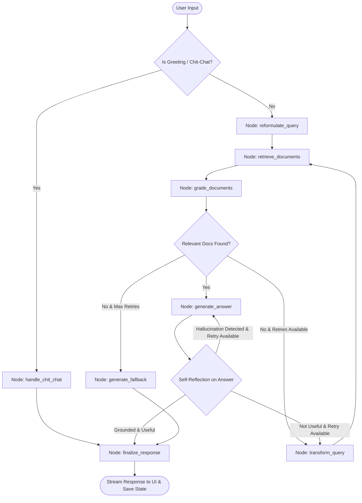

# Conversational PDF Self-RAG Chatbot

**Live Demo:** [Hugging Face Spaces: Conversational_PDF_RAG](https://huggingface.co/spaces/Aryan2301/Conversational_PDF_RAG)

An end-to-end **Self-Reflective Retrieval-Augmented Generation (Self-RAG)** conversational chatbot built with **LangGraph**, **Streamlit**, **Ollama Cloud (`gpt-oss:120b`)**, **ChromaDB**, and **Google Gemini Embeddings**. Upload multiple PDF documents and converse with their content through an autonomous, self-correcting agent state graph.

The agent actively reflects on retrieved context relevance, transforms unhelpful queries, verifies generated answers against hallucinations, and evaluates answer quality before responding.

---

## Key Features

* **Unified Streamlit App:** Single-process architecture — Streamlit directly invokes the RAG pipeline with no separate backend needed.
* **Conversational Intent Router:** Distinguishes general greetings and chit-chat from document questions, replying warmly and instantly without redundant document searches.
* **Self-RAG Architecture with LangGraph:** Autonomous state graph workflow featuring self-reflection, hallucination detection, and query transformation loops.
* **Hybrid Retrieval (BM25 + Semantic Chroma):** Combines lexical keyword matching (BM25) and dense vector search (Chroma) fused via LangChain's native `EnsembleRetriever` using Reciprocal Rank Fusion (RRF).
* **Safe Ingestion Batching:** Document splits are indexed in resilient batches (`EMBEDDING_BATCH_SIZE = 50`) to reliably process large PDFs without exceeding API batch limits.
* **Fully Asynchronous Execution:** Entire graph is implemented with non-blocking async nodes (`ainvoke`) and concurrent evaluations (`asyncio.gather`) for parallel document grading and simultaneous hallucination/relevance verification.
* **Conversational Checkpointer Memory:** Seamlessly preserves conversation history and context across multi-turn interactions (last 5 dialogue turns / 10 messages) using LangGraph's native in-memory checkpointer (`MemorySaver`).
* **Document Relevance Reflection:** Filters out low-quality/irrelevant retrieved chunks concurrently before generation.
* **Dynamic Query Transformation:** Automatically rewrites the query using memory context and retries retrieval if initial documents are insufficient or irrelevant.
* **Hallucination & Faithfulness Guard:** Evaluates if generated responses are factually grounded in the provided document context.
* **Answer Quality Assessment:** Checks that the final answer directly and comprehensively addresses the user's inquiry.
* **Clean Conversational UI:** Distraction-free, centered chat experience with clean message streams.
* **Smart Ingestion Caching:** Vectorstore indexing is cached so PDFs are only processed once per upload batch, eliminating rerun latency.
* **Ollama Cloud Integration:** High-performance reasoning powered by `gpt-oss:120b` via Ollama Cloud.
* **Document Parsing via `pypdf`:** Pure-Python, lightweight, and robust PDF parsing with automatic fallback.
* **Observability with LangSmith:** Full execution tracing out-of-the-box to visualize the agent's graph operations, chunk retrievals, and evaluation steps.
* **Docker Ready:** Fully containerized for easy and consistent deployments.

---

## Tech Stack

* **Orchestration & Workflow:** [LangGraph](https://github.com/langchain-ai/langgraph), [LangChain Core](https://github.com/langchain-ai/langchain)
* **Frontend:** Streamlit
* **LLM Provider:** Ollama Cloud (`gpt-oss:120b` via `langchain-ollama`)
* **Hybrid Retrieval:** BM25 (`rank_bm25`), ChromaDB (`langchain-chroma`), LangChain `EnsembleRetriever`
* **Embeddings:** Google Gemini Embeddings (`gemini-embedding-2`, 768 dimensions via `langchain-google-genai`)
* **Document Processing:** `pypdf` (`PyPDFLoader`), RecursiveCharacterTextSplitter (with UUID chunk deduplication)
* **Observability:** LangSmith

---

## Self-RAG Architecture & Workflow



### Step-by-Step Flow:
1. **Conversational Intent Routing:** Analyzes incoming message. Greetings and pleasantries bypass document retrieval and are answered directly with a warm welcome.
2. **Query Reformulation:** If prior chat history exists, reformulates follow-up document queries into standalone search questions using the last 5 conversation turns.
3. **Retrieval:** Fetches candidate chunks from the hybrid BM25 + Chroma vector store.
4. **Document Relevance Grading:** Evaluates whether each chunk is relevant to the question; filters out noise.
5. **Adaptive Routing:** If no relevant documents are found, rewrites the search query and searches again (up to max retries). If max retries are exceeded, executes an intelligent contextual fallback.
6. **Contextual Generation:** Generates the candidate answer strictly using grounded context chunks and conversational context.
7. **Hallucination & Relevance Reflection:**
   - **Groundedness Check:** Confirms the answer contains no hallucinations.
   - **Answer Relevance Check:** Confirms the answer addresses the user's prompt.
8. **Finalization:** Updates the state graph checkpointer thread and displays the clean answer to the user.

---

## Getting Started

### Prerequisites

* Python 3.11+
* [Ollama Cloud Account & API Key](https://ollama.com/settings/keys)
* [Google AI Studio API Key](https://aistudio.google.com/app/apikey) (for Gemini Embeddings)
* [Hugging Face Token](https://huggingface.co/settings/tokens) (optional)

### 1. Clone the Repository

```bash
git clone <your_repo_url>
cd conversational-pdf-rag
```

### 2. Set Up Environment Variables

Create a `.env` file in the root directory:

```env
OLLAMA_API_KEY="your_ollama_cloud_api_key"
OLLAMA_MODEL="gpt-oss:120b"
OLLAMA_BASE_URL="https://ollama.com"
GOOGLE_API_KEY="your_google_gemini_api_key"
HF_TOKEN="your_huggingface_token"

# Optional: LangSmith Tracing
LANGCHAIN_TRACING_V2=true
LANGCHAIN_ENDPOINT=https://api.smith.langchain.com
LANGCHAIN_API_KEY="your_langsmith_api_key"
LANGCHAIN_PROJECT="PDF_RAG_CHATBOT"
```

---

### Option A: Local Installation

1. **Install dependencies:**

   ```bash
   pip install -r requirements.txt
   ```

2. **Run the app:**

   ```bash
   streamlit run app.py
   ```

   The application will start locally on `http://localhost:8501`.

### Option B: Docker Deployment

1. **Build the Docker image:**

   ```bash
   docker build -t conversational-pdf-self-rag .
   ```

2. **Run the Docker container:**

   ```bash
   docker run -p 7860:7860 --env-file .env conversational-pdf-self-rag
   ```

### Option C: Hugging Face Spaces Deployment

1. **Configure Space Secrets** in your Space Settings:
   - `OLLAMA_API_KEY`
   - `GOOGLE_API_KEY`
   - `OLLAMA_MODEL` (optional, defaults to `gpt-oss:120b`)
   - `OLLAMA_BASE_URL` (optional, defaults to `https://ollama.com`)
   - `HF_TOKEN` (optional)
   - `LANGCHAIN_API_KEY` (optional)

2. **Deploy to both GitHub and Hugging Face Spaces:**

   ```bash
   git add . ; git commit -m "Update" ; git push origin master ; git push pdf-rag master:main
   ```

---

## Project Structure

```
conversational-pdf-rag/
│
├── src/
│   ├── __init__.py          # Package initializer
│   ├── config.py            # Central configuration, constants, and Ollama LLM factory
│   ├── document_loader.py   # Backwards-compatible loader delegating to src.ingestion
│   │
│   ├── core/                # Core business orchestration & service layer
│   │   ├── __init__.py
│   │   └── service.py       # RagService: state graph execution, memory checkpointer, queries
│   │
│   ├── ingestion/           # Document ingestion, splitting, and hybrid retrieval
│   │   ├── __init__.py
│   │   ├── loader.py        # PDF text extraction & metadata sanitization
│   │   ├── splitter.py      # Semantic text splitting & chunking
│   │   ├── retriever.py     # Batched Chroma dense & BM25 sparse hybrid retriever
│   │   └── pipeline.py      # End-to-end ingestion pipeline
│   │
│   ├── graph/               # Self-RAG LangGraph workflow
│   │   ├── __init__.py      # Subpackage exports
│   │   ├── state.py         # GraphState schema definition
│   │   ├── schemas.py       # Pydantic structured output models with normalized scoring
│   │   ├── prompts.py       # Prompt templates (reformulation, grading, generation, hallucination)
│   │   ├── nodes.py         # Self-RAG node functions (SelfRagNodes)
│   │   ├── edges.py         # Conditional routing and self-reflection logic (SelfRagEdges)
│   │   └── workflow.py      # StateGraph assembly and graph compilation
│   │
│   ├── ui/                  # Modular Streamlit UI components
│   │   ├── __init__.py
│   │   ├── sidebar.py       # Modular UI configuration helper
│   │   └── chat.py          # Message bubbles and chat history renderer
│   │
│   └── utils/
│       ├── __init__.py
│       └── helpers.py       # Hashing, citation formatting, safe async executor
│
├── app.py                   # Streamlit app (UI + direct RAG pipeline execution)
├── requirements.txt         # Project dependencies (LangGraph, Ollama, Chroma, Streamlit)
├── Dockerfile               # Docker configuration for HF Spaces deployment
├── .env                     # Environment variables (API keys)
├── .gitignore               # Git ignore rules
└── README.md                # Project documentation and Self-RAG architecture diagram
```

---

## Example Use Cases

* **Research Paper Q&A:** Deep dive into complex papers with hallucination-checked citations.
* **Technical Manuals & Documentation:** Pinpoint exact steps and verify factual accuracy.
* **Legal & Contract Analysis:** Ensure responses reflect only the uploaded text.
* **Educational Assistant:** Chat with textbooks and lecture notes with conversational memory.

---

## License

This project is open-source and available under the [MIT License](LICENSE).